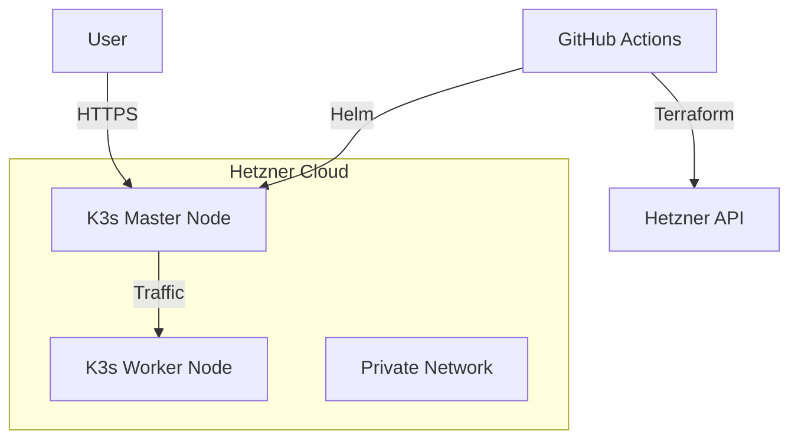

# The Mary Anne

## Overview
This repository contains the infrastructure and deployment configuration for running [LibreChat](https://github.com/danny-avila/LibreChat) on Hetzner Cloud. The setup uses Terraform to provision a K3s Kubernetes cluster on Hetzner Cloud servers and GitHub Actions for Continuous Deployment.

## Architecture

### High-Level Diagram


### Components
- **Terraform**: Provisions the VMs (`hcloud_server`) and Network (`hcloud_network`).
- **K3s**: Lightweight Kubernetes distribution installed via Cloud-Init.
- **Helm**: Manages the application deployment.

## Submodules
This repository aggregates several key components as Git submodules:

- **[LibreChat](https://github.com/danny-avila/LibreChat)** (`LibreChat/`)  
  The core open-source chat application. We track the official repository to stay updated with the latest features and fixes.

- **[LibreChatMCP](https://github.com/simonvanlaak/LibreChatMCP)** (`LibreChatMCP/`)  
  A custom Model Context Protocol (MCP) server designed for managing LibreChat. It provides tools for agent management, user-specific file storage, and RAG-powered semantic search.

- **[zotero-mcp](https://github.com/josk0/zotero-mcp)** (`zotero-mcp/`)  
  An MCP server that integrates Zotero reference management into LibreChat, allowing agents to access and cite research papers.

- **[librechat-docs](https://github.com/LibreChat-AI/librechat.ai)** (`docs/librechat-docs/`)  
  The official LibreChat documentation source, kept here for easy reference and offline access.

## Prerequisites

### Required Accounts
- **GitHub Repository**: You must have this repository cloned or forked.
- **Hetzner Cloud Account**: Create an account and generate an API token.
- **Terraform Cloud Account**: Create an organization and workspace for remote state management.

### Generate SSH Key Pair
If you do not have an SSH key pair:
```bash
ssh-keygen -t ed25519 -C "TheMaryAnne-ssh-key" -f TheMaryAnne-ssh-key -N ""
```
- Add `TheMaryAnne-ssh-key` text content as GitHub secret with key `SSH_PRIVATE_KEY`.
- Add `TheMaryAnne-ssh-key.pub` text content as GitHub secret with key `SSH_PUBLIC_KEY`.

## Configuration

### Required GitHub Secrets
Add the following secrets to your GitHub repository (Settings → Secrets and variables → Actions):

- `HETZNER_API_TOKEN`: Your Hetzner Cloud API token.
- `TF_API_TOKEN`: Your Terraform Cloud user API token (for CLI authentication).
- `TF_WORKSPACE_ID`: The workspace ID from Terraform Cloud (e.g., `ws-xxxxxx`).
- `SSH_PRIVATE_KEY`: The private SSH key for server access.
- `SSH_PUBLIC_KEY`: The public SSH key to register in Hetzner Cloud.
- `LIBRECHAT_ENV`: The contents of your `.env` file for LibreChat (optional, for secret management).
- `HOST`: The domain name for LibreChat ingress (e.g., `chat.example.com`). This will automatically get an SSL certificate via Let's Encrypt.
- `CERT_MANAGER_EMAIL`: Email address for Let's Encrypt certificate registration and renewal notifications.

### Important: .env File Restrictions
- The `.env` file **must not contain the `&` symbol** in any value. This will break secret creation and deployment in Kubernetes and CI/CD workflows.
- Only use valid `KEY=VALUE` pairs. Avoid shell operators and special characters that may be interpreted by the shell.

### Configure Terraform Cloud (VCS-Connected Workspace)
- In Terraform Cloud, create a workspace and choose "Version Control workflow".
- Connect your GitHub repository to the workspace using the Terraform Cloud UI.
- Terraform Cloud will automatically manage state and runs for you—**no backend block is needed in your Terraform code**.
- Add any required Terraform variables in the workspace UI (e.g., `hcloud_token`, `ssh_public_key`).
- Copy the workspace ID and add it to the `TF_WORKSPACE_ID` secret if your workflow requires it.

## Deployment

### Automated Deployment (CI/CD)
The deployment is fully automated via GitHub Actions. The workflow (`.github/workflows/deploy.yml`) consists of the following steps:

1. **Checkout**: Retrieves the code.
2. **Terraform Apply**: Provisions the K3s cluster on Hetzner.
3. **Get Kubeconfig**: Retrieves the `k3s.yaml` config from the master node via SSH.
4. **Deploy Configs**: Creates Kubernetes ConfigMaps and Secrets from local files.
5. **Helm Upgrade**: Deploys the application.

#### First Deployment
- Push any change to the `main` branch, or trigger the workflow manually in GitHub Actions.
- The workflow will:
  1. Check for required secrets.
  2. Register the SSH public key in Hetzner Cloud if not present.
  3. If the key was newly registered, automatically recreate the servers with the correct key.
  4. Provision infrastructure using Terraform Cloud.
  5. Fetch kubeconfig from the main node via SSH.
  6. Deploy LibreChat using Helm with automatic HTTPS/SSL certificate setup via cert-manager and Let's Encrypt.
  7. The SSL certificate for your domain (specified in `HOST` secret) will be automatically issued and renewed.

### Manual Deployment

#### Helm Installation
The application is packaged and deployed using Helm.

- **Chart Location**: `./helm/librechat`
- **Installation**:
  ```bash
  helm upgrade --install librechat ./helm/librechat \
    --set ingress.host=$HOST \
    --set ingress.enabled=true \
    --set librechatmcp.image=ghcr.io/simonvanlaak/librechatmcp \
    --set librechatmcp.tag=latest
  ```

#### Terraform Apply (local)
```bash
cd terraform
terraform init
terraform apply
```

## Operations

### Accessing the Kubernetes Cluster

#### SSH into the Main Node
To SSH into your main node (using your DNS record and the correct key), use:
```bash
ssh -i ./TheMaryAnne-ssh-key -o IdentitiesOnly=yes root@chat.simonvanlaak.de
```
This ensures only your specified key is used and avoids authentication failures due to multiple loaded keys.

#### Access Cluster via kubectl
To access your Kubernetes cluster from your local machine:

1. **Copy kubeconfig from the remote host:**
   ```bash
   scp -i ./TheMaryAnne-ssh-key -o IdentitiesOnly=yes root@chat.simonvanlaak.de:/etc/rancher/k3s/k3s.yaml ~/.kube/config
   ```

2. **Update kubeconfig to use your DNS name:**
   ```bash
   sed -i "s/127.0.0.1/chat.simonvanlaak.de/g" ~/.kube/config
   chmod 600 ~/.kube/config
   ```

3. **Access the cluster:**
   ```bash
   kubectl get nodes
   kubectl get pods -A
   kubectl get svc -A
   ```

### Monitoring & Logging
- **Logging**: Use `kubectl logs -l app=librechat` to view application logs.
- **Monitoring**: Can be added via Prometheus/Grafana Helm charts.

### LibreChat MCP Deployment
LibreChat MCP is deployed as part of your Kubernetes stack. The CI/CD pipeline will build and push the Docker image, then deploy it using Helm.

#### CI/CD Pipeline Steps
1. **Build Docker image:**
   ```bash
   docker build -t ghcr.io/simonvanlaak/librechatmcp:latest -f LibreChatMCP/Dockerfile LibreChatMCP
   ```
2. **Push Docker image:**
   ```bash
   docker push ghcr.io/simonvanlaak/librechatmcp:latest
   ```
3. **Deploy with Helm:** (see Helm Installation above)

   ```

## Troubleshooting

### Common Issues
- **SSH Permission Denied**: Ensure the public key is registered in Hetzner Cloud and the private key matches.
- **Kubeconfig Error**: Ensure `SSH_PRIVATE_KEY` is correct and the master node is reachable.
- **Terraform Token Error**: Make sure `TF_API_TOKEN` is set and valid.
- **Missing Secrets**: The workflow will fail early and print a clear error if any required secret is missing.
- **Kubeconfig Not Found**: Wait for the server to finish provisioning, or check SSH key setup.
- **Pod Pending**: Check if worker nodes are joined (in this minimal setup, check `kubectl get nodes`).

### Manual Steps (if needed)
- You may need to destroy/recreate servers if you change the SSH key after initial deployment.
- You can manually run `terraform taint` and `terraform apply` in the `terraform/` directory if needed.

## Roadmap

For current bugs, todos, and planned features, see [ROADMAP.md](ROADMAP.md).
